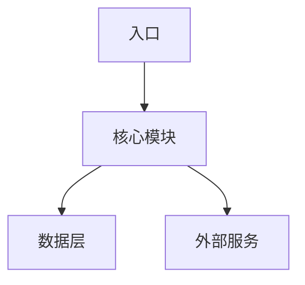

# {{PROJECT_NAME}} 架构文档

> last_verified: {{CREATED_DATE}}

## 概览

{{PROJECT_GOAL}}

## 技术栈

| 领域 | 选型 | 备注 |
|---|---|---|
| 运行时 | {{TECH_STACK}} | |
| 包管理 | | |
| 测试 | | |

## 系统架构



> 随项目演进更新此图。运行 `/update-architecture` 同步代码变更。

## 目录结构

```
src/
├── ...
```

## 变更日志

| 日期 | 变更 | 影响 |
|---|---|---|
| {{CREATED_DATE}} | 初始化架构文档 | — |
