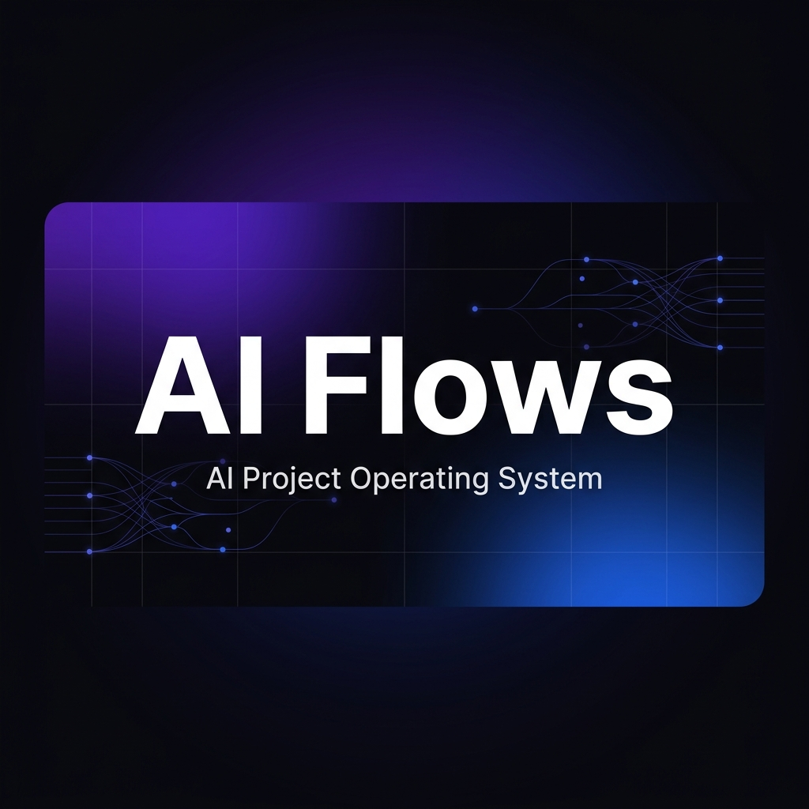

<div align="center">



<br />

**Fork. Init. Build with AI.**

一个可 fork 的 AI 项目操作系统 — 内置记忆治理、项目孵化、15 个标准化工作流和多 Agent 支持。

[](CHANGELOG.md)
[](LICENSE)
[](#-工作流)
[](#-项目模板)

</div>

---

## ⚡ 30 秒启动

```bash
# 1. Fork 本仓库
# 2. 克隆到本地
git clone https://github.com/<your-username>/AI-Flows.git
cd AI-Flows

# 3. 运行初始化向导
node scripts/init.mjs

# 4. 开始与 AI agent 对话，孵化你的第一个项目
```

---

## 🤔 这是什么？

> **AI Flows 不是一个普通的代码仓库。**
> 它是一个让你和 AI Agent 高效协作的**操作系统级框架**。

<table>
<tr>
<td width="50%">

### 🧠 持久记忆
跨对话的项目记忆、决策追踪和**记忆治理**——自动归档、防止旧事实误导、Token 预算控制。

</td>
<td width="50%">

### 🚀 项目孵化
通过对话创建和推进项目。4 个版本化模板，自动初始化标准结构，一条命令从零到一。

</td>
</tr>
<tr>
<td width="50%">

### 📋 15 个工作流
从 Git 协作、代码审查、任务拆解到架构同步、门禁检查——覆盖项目全生命周期。

</td>
<td width="50%">

### 🔌 多 Agent 原生支持
一个 `AGENTS.md` 驱动 8 个主流 AI 编程工具。Fork 即用，无需额外配置。

</td>
</tr>
</table>

---

## 🏗️ 架构

```
AI-Flows/
├── AGENTS.md                    # 🎯 唯一信息源 — Agent 规则 (v4.0)
├── MEMORY.md                    # 🧠 长期记忆
├── CHANGELOG.md                 # 📝 版本变更日志
├── CONTRIBUTING.md              # 🤝 协作指南
│
├── memory/                      # 📂 根级记忆
│   ├── README.md                #    记忆治理规则
│   ├── tasks.md                 #    任务跟踪
│   └── archive/                 #    阶段归档
│
├── projects/                    # 📦 项目容器
│   ├── registry.yml             #    项目索引 (schema v2)
│   └── <slug>/                  #    各项目独立空间
│       ├── AGENTS.md            #    项目级规则
│       ├── docs/ARCHITECTURE.md #    架构文档
│       └── memory/              #    项目级记忆
│
├── .agents/
│   ├── workflows/               # ⚙️  15 个标准化工作流
│   ├── templates/               # 📐 4 个版本化模板
│   ├── skills/                  # 🛠️  技能库
│   └── i18n/                    # 🌐 语言包
│
├── scripts/                     # 🔧 工具脚本
│   ├── init.mjs                 #    初始化向导
│   └── sync-agents.mjs          #    多 Agent 适配同步
│
└── .github/                     # 🤖 GitHub 自动化
```

---

## 📋 工作流

> 通过 Slash 命令调用，覆盖从代码提交到项目发布的完整链路。

### 管理层

| 命令 | 描述 |
|:---|:---|
| `/commit` | 生成规范提交命令 — 中文 message + Scope 映射 |
| `/feature-branch` | 创建工作分支 — 遵循命名规范 |
| `/pr` | 创建 Pull Request — 自动生成描述和检查清单 |
| `/issue` | 管理 GitHub Issue |
| `/release` | 发布就绪检查 + Annotated Tag |
| `/incubate-project` | 孵化新项目 — 模板初始化 + 注册 |
| `/lifecycle` | 项目生命周期 — building → paused → archived → migrated |
| `/status` | 审计仓库状态 — 进展、风险、下一步 |
| `/doctor` | 仓库健康检查 — 结构、记忆、一致性 |
| `/closeout` | 任务收尾 — 验证、日志、架构、任务闭环 |
| `/memory-maintenance` | 记忆维护 — 归档旧任务、清理过时信息 |

### 执行层

| 命令 | 描述 |
|:---|:---|
| `/task-breakdown` | 从需求文档拆解原子可执行任务 |
| `/review` | 结构化代码审查 — 输出可归档报告 |
| `/gate-check` | 阶段门禁 — 检查是否满足里程碑标准 |
| `/update-architecture` | 架构文档同步 — 代码变更后自动更新 |

---

## 📐 项目模板

| 模板 | 适用场景 | 版本 |
|:---|:---|:---:|
| **`app-starter`** | 通用应用、SaaS、工具类产品 | `1.0.0` |
| **`api-starter`** | REST / GraphQL API、后端服务 | `1.0.0` |
| **`website-starter`** | 落地页、文档站、企业官网 | `1.0.0` |
| **`agent-starter`** | AI Agent、工作流、自动化系统 | `1.0.0` |

每个模板包含：`AGENTS.md` · `MEMORY.md` · `CHANGELOG.md` · `docs/ARCHITECTURE.md` · `memory/` 完整结构

---

## 🔌 多 Agent 支持

**`AGENTS.md` 是唯一信息源。** 其他文件由 `scripts/sync-agents.mjs` 自动生成。

| AI 工具 | 配置文件 | 状态 |
|:---|:---|:---:|
| Codex (OpenAI) | `AGENTS.md` | ✅ |
| Open Code | `AGENTS.md` | ✅ |
| Antigravity (Google) | `AGENTS.md` | ✅ |
| Claude Code | `CLAUDE.md` | ✅ |
| Gemini CLI | `GEMINI.md` | ✅ |
| Cursor | `.cursor/rules/ai-flows.mdc` | ✅ |
| Windsurf | `.windsurf/rules/ai-flows.md` | ✅ |
| GitHub Copilot | `.github/copilot-instructions.md` | ✅ |

---

## 💡 设计理念

<table>
<tr>
<td align="center" width="33%">
<br />
<strong>📄 文件即记忆</strong><br />
<sub>所有重要信息持久化到仓库文件<br/>而非依赖对话上下文</sub>
<br /><br />
</td>
<td align="center" width="33%">
<br />
<strong>📏 约定优于配置</strong><br />
<sub>标准目录结构和命名约定<br/>减少认知负担</sub>
<br /><br />
</td>
<td align="center" width="33%">
<br />
<strong>🚀 渐进式复杂度</strong><br />
<sub>从 fork 到孵化第一个项目<br/>只需几分钟</sub>
<br /><br />
</td>
</tr>
<tr>
<td align="center" width="33%">
<br />
<strong>🧩 可组合架构</strong><br />
<sub>技能、模板、工作流<br/>可独立演进和复用</sub>
<br /><br />
</td>
<td align="center" width="33%">
<br />
<strong>💰 Token 预算优先</strong><br />
<sub>5 级分层读取策略<br/>控制上下文消耗</sub>
<br /><br />
</td>
<td align="center" width="33%">
<br />
<strong>✅ 收尾自动化</strong><br />
<sub>每次工作闭环检查<br/>防止遗漏和技术债</sub>
<br /><br />
</td>
</tr>
</table>

---

## 🌐 语言策略

- **中文为主**：文档、说明、模板内容、Git commit 标题
- **英文为辅**：代码、Git type/scope、分支名、技术术语、工作流 YAML description
- **国际化**：`.agents/i18n/` 提供英文语言包

---

## 🤝 参与贡献

参阅 [CONTRIBUTING.md](CONTRIBUTING.md) 了解分支策略（`main + develop + feature/*`）、提交规范和协作约定。

---

<div align="center">

**[🚀 快速开始](#-30-秒启动)** · **[📋 工作流](#-工作流)** · **[📐 模板](#-项目模板)** · **[📝 变更日志](CHANGELOG.md)**

<sub>Built with 🤖 for humans who build with AI.</sub>

MIT License © 2025

</div>
