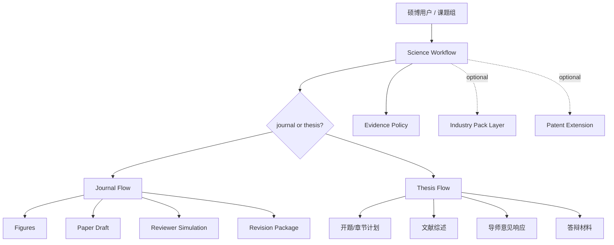

# Science Workflow 架构文档

> last_verified: 2026-06-09

## 概览

Science Workflow 是一个面向硕博个人的 UI-less 科研写作 Agent 工作流。首版主线覆盖通用 SCI/期刊论文和硕博论文，煤化工/能源化工作为可切换行业包，专利能力保留为可选 extension。

## 分层架构

| 层级 | 选型 | 职责 |
|---|---|---|
| 主工作流 | `science-workflow.md` | 判断 Journal / Thesis 场景，串联文献、证据、图表、写作、审阅与交付 |
| 证据治理 | `docs/EVIDENCE_POLICY.md` | 约束真实数据、导师意见、引用核验、查重风险和 AI 辅助边界 |
| 成果包追踪 | `docs/DELIVERABLES.md` + `RUN_STATE.example.json` | 定义 Journal Package、Thesis Package、Gate 状态和验证记录 |
| 通用写作内核 | `nature-writing`、`nature-polishing`、`nature-reviewer`、`nature-response` | 提供论文结构、语言润色、模拟审稿和返修响应 |
| 科研图表内核 | `nature-figure` + `scripts/plot_figures.py` | 生成可复现图表，输出到本地 ignored 目录 |
| 行业包层 | `_shared/domain/ai-coal-chem.md` | 默认示例行业包，提供煤气化、热化学、过程模拟、AI for Science 和工业控制语境 |
| 专利 extension | `scipatent-lifecycle.md`、`patent-trans`、`patent-claim-check` | 仅在用户明确选择成果转专利时执行 |

## 数据流

## 运行约束

- `Science Workflow` 默认不进入专利阶段。
- 真实论文、导师意见、图表、用户数据和当前 run state 均为本地产物，不进入提交。
- 所有结论必须绑定证据等级；`mock` 只可用于演示和流程测试。
- 行业包按需加载，不把通用写作内核写死到单一学科；煤化工/能源化工仅是默认示例行业包。

## 变更日志

| 日期 | 变更 | 影响 |
|---|---|---|
| 2026-06-04 | 架构重构为 UI-less Agent Workflow | 冻结 Web UI，建立论文到专利的 6-Gate 工作流 |
| 2026-06-05 | 增加可信协作层 | 补充证据分级、成果包追踪、运行状态样例与绘图复现约束 |
| 2026-06-05 | 转向 Science Workflow | 商业主线调整为 SCI/期刊论文和硕博论文，煤化工为默认示例行业包，专利降为 extension |
| 2026-06-09 | 通用化转向 | 主线叙事改为通用学术写作 + 可切换行业包，煤化工退回示例层 |
| 2026-06-15 | 引用基线与本地测试闭环 | `templates/citation_verification.md` 升级为基线文献矩阵 + Research Gap 两段式；为 `nature-academic-search` MCP 增加 `pytest.ini` / `tests/conftest.py` / `requirements-dev.txt` 与 README 本地测试小节，31 用例本地可收集可跑 |
