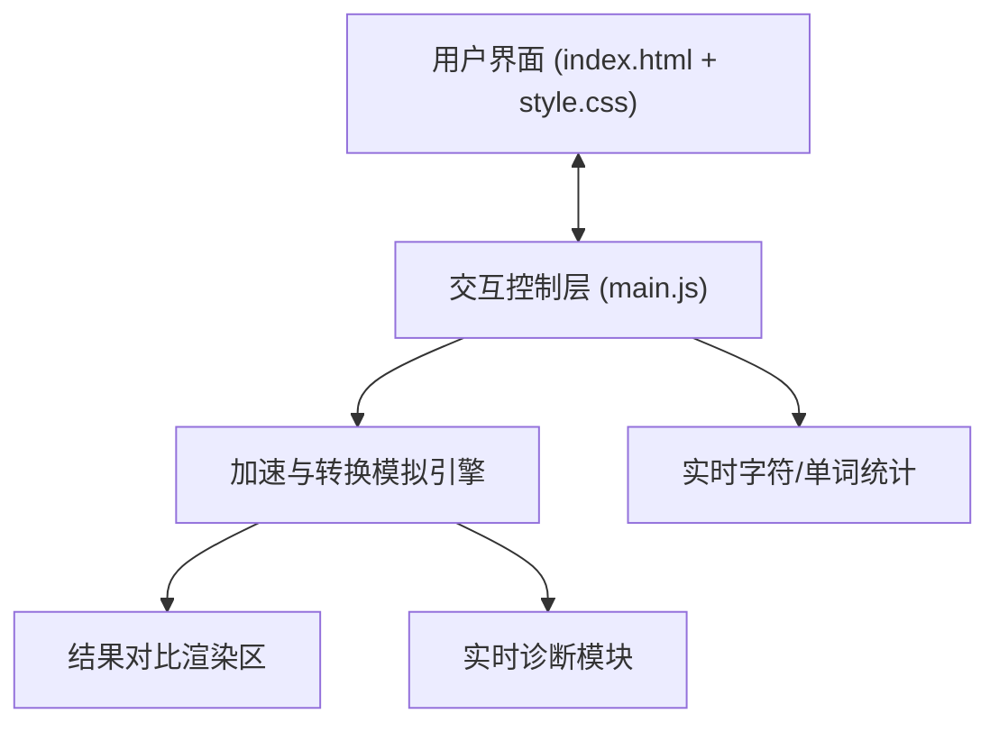

# 学术论文与专利协作平台 架构文档

> last_verified: 2026-06-01

## 概览

整合学术写作润色、模拟盲审、学术转专利语言与权利要求书校验的一站式科研工作台

## 技术栈

| 领域 | 选型 | 备注 |
|---|---|---|
| 运行时 | HTML5 + JavaScript + Vanilla CSS | 遵循轻量且高美感的前端规范 |
| 构建与服务 | Vite 5.x | 本地开发服务器，提供 HMR |
| 包管理 | npm | 管理开发依赖 |
| 测试 | Vitest (后续引入) | 自动化单元测试 |

## 系统架构



## 目录结构

```text
paper-patent-assistant/
├── index.html              # 主入口页面
├── package.json            # 依赖与构建配置
├── src/
│   ├── main.js             # 页面控制与模拟核心逻辑
│   └── style.css           # 视觉样式与微动效
├── docs/
│   └── ARCHITECTURE.md     # 架构文档
└── memory/
    ├── tasks.md            # 项目任务追踪
    └── 2026-06-01.md       # 项目今日工作日志
```

## 变更日志

| 日期 | 变更 | 影响 |
|---|---|---|
| 2026-06-01 | 搭建 UI 原型与开发环境 | 完成 index.html、main.js、style.css 的编码，配置 Vite 并成功安装依赖 |
| 2026-06-01 | 初始化架构文档 | — |
